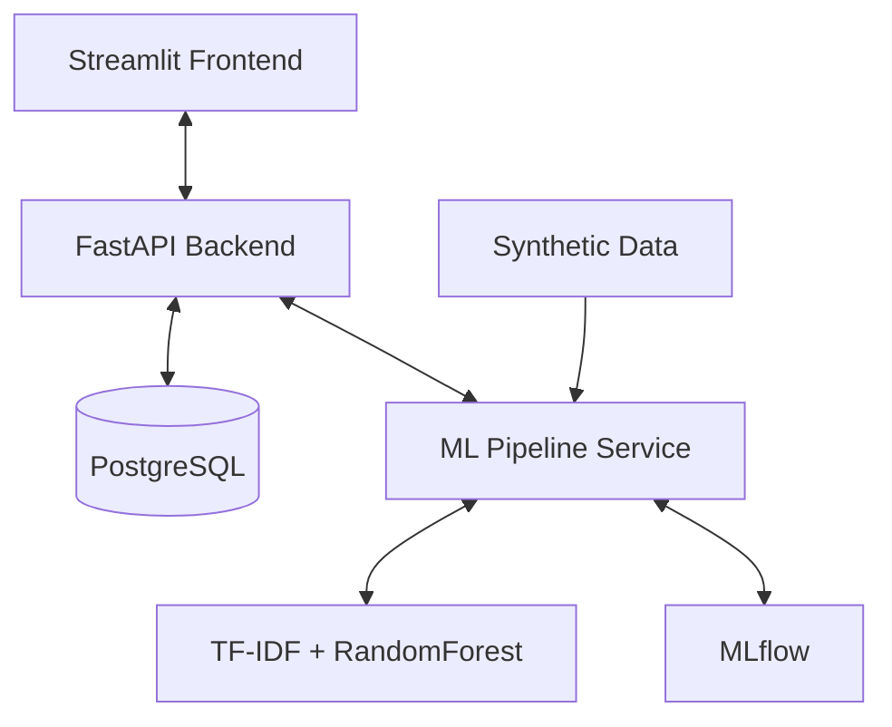

# SupportFlow — Intelligent Customer Support Platform

**Week 1 Project** of the 12-Week AI Mastery Plan.

A fullstack ML application that automatically classifies support tickets, predicts urgency, resolution time, and priority using Machine Learning.

## Features

- **AI-Powered Ticket Analysis**: Auto-categorization, urgency detection, resolution time & priority prediction
- **FastAPI Backend** with async SQLModel + PostgreSQL
- **Streamlit Frontend** for ticket submission and dashboard
- **Synthetic Data Generation** (75k+ samples)
- **ML Pipeline** with TF-IDF + RandomForest
- **Docker + docker-compose** multi-container setup
- **MLflow** experiment tracking ready
- **Comprehensive logging** with Loguru

## Tech Stack

- **Backend**: FastAPI, SQLModel, asyncpg
- **ML**: scikit-learn, Sentence-Transformers (planned), Pandas, NumPy
- **Frontend**: Streamlit + Plotly
- **Database**: PostgreSQL
- **Others**: Docker, Loguru, MLflow, DVC (setup ready)

## Architecture



### How to Run

```bash
cd projects/week1-supportflow
docker-compose up --build
```

* Backend: http://localhost:8000
* Frontend: http://localhost:8501
* API Docs: http://localhost:8000/docs

### Key Learnings
* Solid understanding of Linear Regression & Classification from CS229 Lecture 1-2
* Docker networking, healthchecks, and async database connections
* Importance of proper environment configuration in containerized environments
* First chapter of *Designing Machine Learning* Systems by Chip Huyen